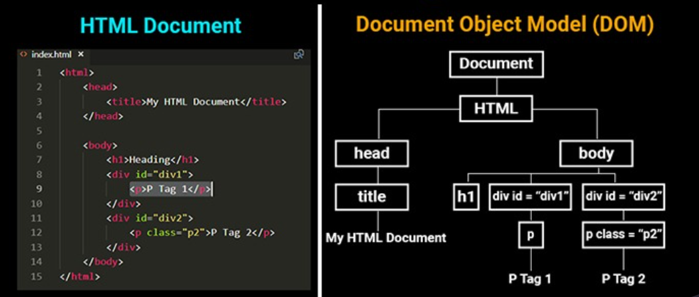

<h1 align="center">
   
  
   
     
        Semana 5
     
      
        Eiii, turma teens, estou de volta!!! Que alegria fazer parte da trajetória de vocês!😃
  <h2 align="center">
  
{Profa} Tassi Bomfim 

  </h2>
     

</h1>
Estamos na quinta semana e já aprendemos muitas muitaaas coisas!

O que estão achando do nosso queridíssimo Javascript?? 

É um pouco difícil no inicio, mas nada como a prática, e falando em prática, vamos colocar a mão na massa, opss.. no código?

 
Agora que começamos a aplicar lógica de programação  as aplicações, pensamos no algoritmo e recebemos inputs, simulando um usuário. 

Chegou o momento de conhecer o DOM e manipular a estrutura do HTML com Javascrip, opa calma.. Antes de avançar com o DOM vamos aprender um pouco mais de Javascript. 

---
<h2 align="center">
   
  
   
</h2>

## Javascript II

Separei também um diretório somente para esse assunto, refências para estudo e atividade para casa.

Nesse tópico vamos abordar:

1. `Operadores lógicos e condicionais`
2. `Array`
3. `Funções e parâmetros`

---

<h2 align="center">
   
  
   
</h2>

## DOM

Temos um diretório especial nesse repositório que deixo contéudo, referências para estudos e atividade para casa. 

Nesse tópico vamos abordar:

1. `O que é DOM?`
2. `Como acessar e manipular o conteúdo do HTML pelo DOM`
4. `Métodos do DOM para manipular CSS`
3. `Eventos no Browser`
4. `Formas de usar eventos na Web`

---
## Extra

Aqui a apresentação da [aula](https://www.canva.com/design/DAElokkNUrs/4VRi0ASYxlZZH61TZrK9qQ/view?utm_content=DAElokkNUrs&utm_campaign=designshare&utm_medium=link&utm_source=publishsharelink)!

---
---
## Dicas: 

- Tenha calma, não entendeu? Leia novamente, quantas vezes for necessário.
- Não queira ver o final! Um passo de cada vez, primeiro resolve um ponto e depois passe para o passo seguinte.
- Não existe apenas uma resposta certa.
- Se esqueceu de  como declarar variáveis, algum operador lógico ou o que realmente faz? Consulte o google, veja exemplos e leia a documentação.
- Juntem-se para trocar figurinhas.

---
# Tenho certeza que vocês vão arrasar! 

##  E contem comigo! 
## Tassila Bomfim
  Onde vocês me encontram:
  - [Linkedin](https://www.linkedin.com/in/tassilabomfim/)
  - [Instagram](https://www.instagram.com/tassilabomfim/)
